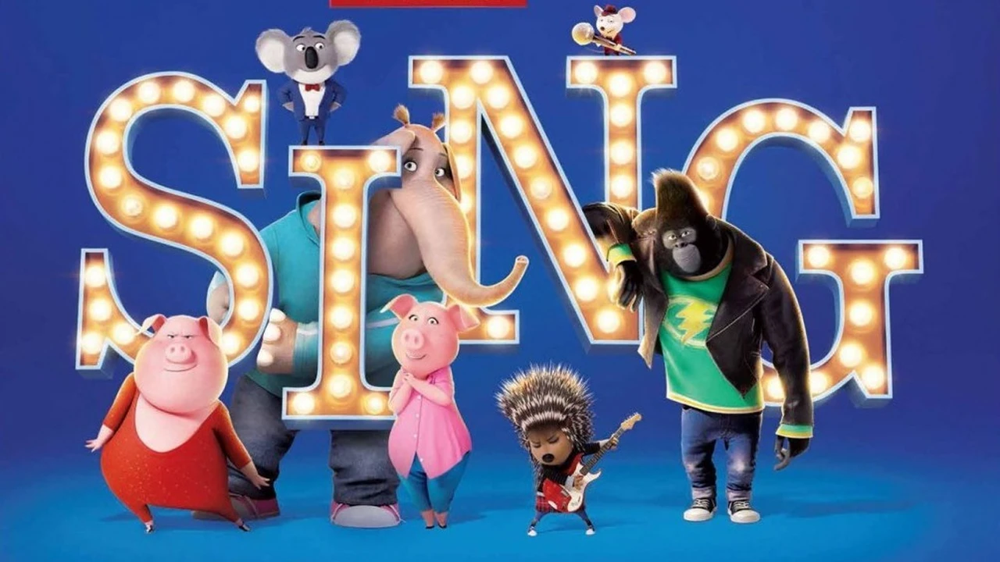
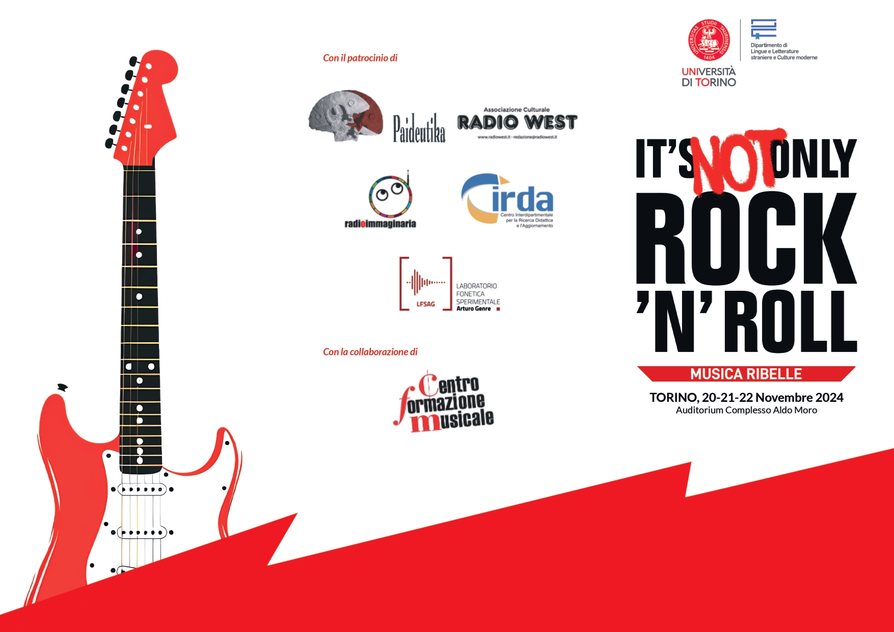
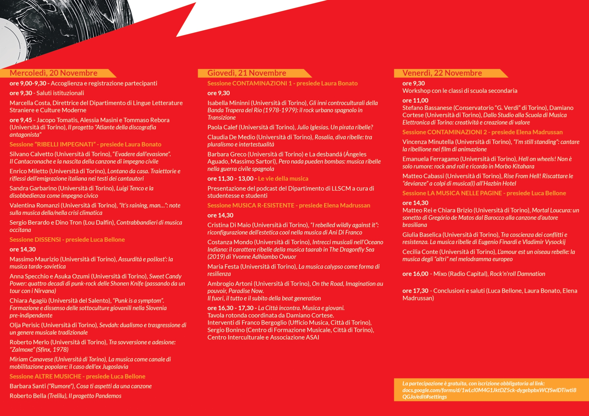

<h1>Song Translation Project: <em>Sing</em></h1>

In this project, I translated and adapted two songs from the animated film <em>Sing</em>. 
The adaptations respect the <strong>Penthatlon Principle</strong>, ensuring singability, natural phrasing, and rhythmic consistency in Italian.

<figure style="text-align: center;">
  
</figure> 
<h2>Conference Presentation</h2>

The project was presented at the University of Turin conference 
<em>"It's not Only Rock'n' Roll: Musica Ribelle"</em>. 
Together with Prof. Vincenza Minutella and my colleagues, we performed and showcased the adapted songs.

<figure style="text-align: center;">
  
</figure>
<figure style="text-align: center;">
  
</figure>

<h2>Original vs Translated Lyrics</h2>

Comparison of the original song lyrics, my Italian adaptation, and a back translation into English.

<table style="width:100%; table-layout: fixed; border-collapse: collapse;" border="1">
  <thead>
    <tr>
      <th style="width:33%; padding:10px;">Original Lyrics</th>
      <th style="width:33%; padding:10px;">Italian Translation & Adaptation</th>
      <th style="width:33%; padding:10px;">Back Translation</th>
    </tr>
  </thead>
  <tbody>
    <tr>
      <td>I've followed my heart into the fire 
          Got burned, got broken down by desire 
          I've tried, I've tried but the smoke in my eyes 
          Left me blurry, blurry and blind  
          I've picked all the pieces up off the ground  
I've burned all my fingers, but that's gone now  
Got the glue in my hands and stickin' to the plan  
Stickin' to the plan that says  
I can do anything at all  
I can do anything at all  
This is my kiss goodbye  
You can stand alone and watch me fly  
'Cause nothing's keeping me down  
Gonna let it all up  
Come on and say right now, right now, right now  
This is my big hello  
'Cause I'm here and never letting go  
I can finally see, it's not just a dream  
When you set it all free, all free, all free  
You set it all free  
      </td>
      <td>Ero accecata dal tuo amore 
          Hai spezzato in due il mio cuore 
          Ci ho provato davvero, questo lo sai 
          Non funziona, non funzionerà mai  
          Ho raccolto i cocci dal pavimento  
          Nascosto dentro me il sentimento  
          Non importa cosa pensavi  
Ora sono solo ricordi lontani  
La mia vita è nelle mie mani  
Sarà come spiegare le ali  
Questo è il mio bacio d’addio  
Posso essere felice anch’io  
E Niente poi tratterrà  
La mia libertà 
Non mi fermerai mai e poi mai e poi mai 
 Questo è un addio per me  
Non ho bisogno di uno come te  
Ora posso brillare, suonare e cantare  
E lasciarmi andare, andare, andare  
Senza di te  
</td>
      <td>I was blinded by your love 
          You broke my heart in two 
          I really tried, you know that 
          It doesn't work, it will never work  
          I picked up the pieces from the floor  
          Hid the feeling inside.  
          It doesn't matter what you thought  
          Now they are just distant memories  
          My life is in my hands   It will be like spreading my wings   
          This is my goodbye kiss   I can be happy too   
          And nothing will hold back my freedom   You'll never, ever, ever stop me  
          This is goodbye for me  
         I don't need someone like you  
        Now I can shine, play and sing  
        And let myself go, go, go  
        Without you  
    </table>

    

<h2>Read More</h2>

For a detailed discussion of the translation process, see our conference paper: 
<a href="https://doi.org/10.13135/2420-7969/21" target="_blank"> Carlotta Anna ANTONACCI, Gaia BUONSANTI, Gaia FARACI, Vincenza MINUTELLA • The Sound of Rebellion. Adattare le canzoni nei film di animazione</a>.

<a href="/portfolio/" class="back-link">← Go back to Portfolio</a>
